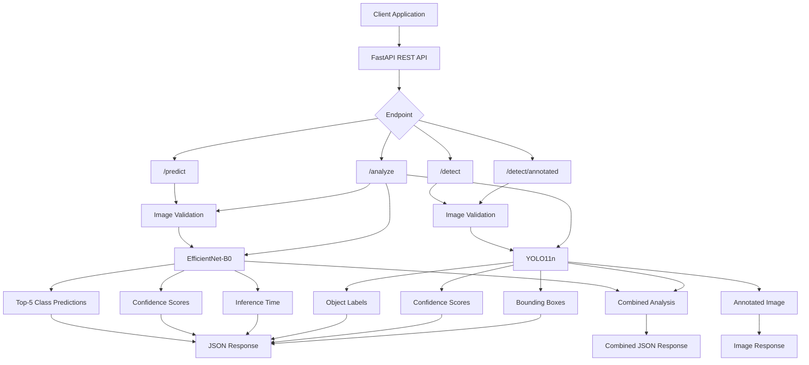
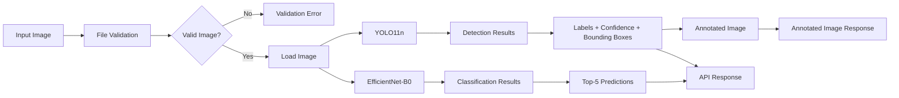
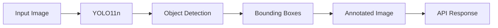
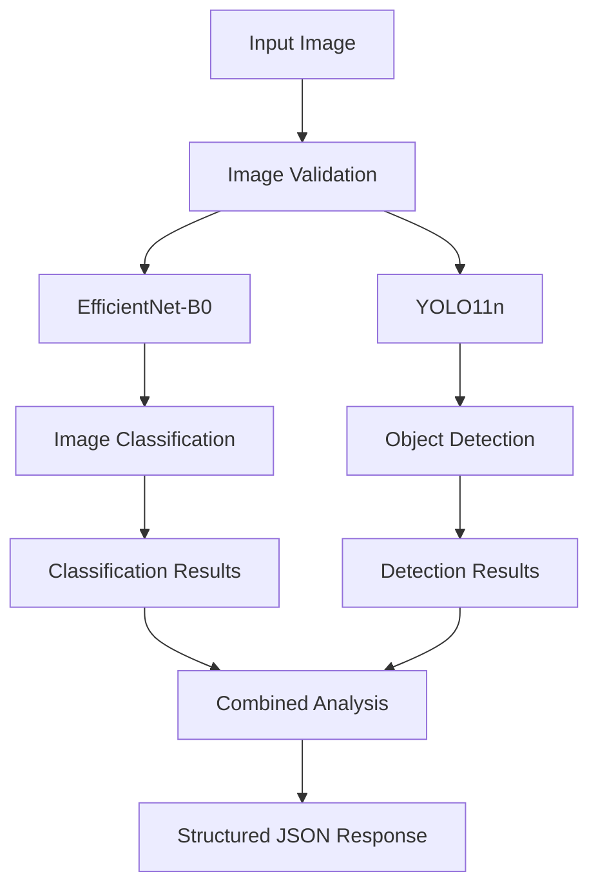
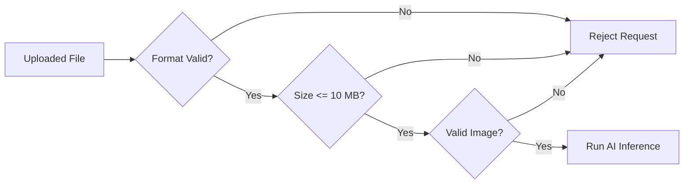
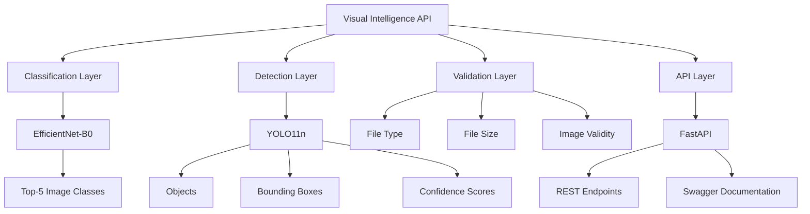

# 👁️ AI Visual Intelligence API

An AI-powered **REST API for visual intelligence** that combines image classification and object detection into a unified FastAPI service.

The project uses **EfficientNet-B0** for image classification and **YOLO11n** for object detection, providing structured predictions, confidence scores, bounding boxes, inference timing, annotated images, and combined visual analysis through RESTful API endpoints.

---

## 🚀 Overview

Computer vision models are often exposed as isolated scripts or notebooks. This project converts pretrained vision models into a reusable **API-first computer vision service**.

The API supports:

* 🖼️ Image classification
* 🎯 Object detection
* 📦 Bounding-box coordinates
* 📊 Top-5 classification predictions
* 📈 Confidence scores
* ⏱️ Inference-time measurement
* 🖍️ Annotated detection images
* 🔍 Combined classification + detection
* 🛡️ Image type and file-size validation
* 📚 Interactive Swagger documentation

---

## 🎯 Objective

Build a lightweight REST API that allows applications to send an image and receive structured computer vision results without directly interacting with the underlying PyTorch or YOLO model implementations.

---

# 🏗️ System Architecture



---

# 🧠 AI Models

## EfficientNet-B0

EfficientNet-B0 is used for **image classification**.

The model is loaded through Torchvision and produces the top-5 predicted ImageNet classes along with confidence scores.

### Output

```json
{
  "label": "golden retriever",
  "confidence": 0.9376
}
```

---

## YOLO11n

YOLO11n is used for **object detection**.

The detector identifies objects and returns:

* Object label
* Confidence score
* Bounding-box coordinates
* Detection inference time

The required `yolo11n.pt` model is included in the repository.

---

# 🔄 Image Analysis Pipeline



---

# 🔌 API Endpoints

| Method | Endpoint            | Purpose                             |
| ------ | ------------------- | ----------------------------------- |
| `GET`  | `/`                 | API status                          |
| `GET`  | `/health`           | Health check                        |
| `POST` | `/predict`          | Image classification                |
| `POST` | `/detect`           | Object detection                    |
| `POST` | `/detect/annotated` | Detection with annotated image      |
| `POST` | `/analyze`          | Combined classification + detection |

---

# 🖼️ `/predict`

Performs image classification using **EfficientNet-B0**.

### Input

```text
Image file
```

### Output

Returns the top-5 predicted ImageNet classes with confidence scores and inference time.

### Example

```json
{
  "filename": "sample.jpg",
  "content_type": "image/jpeg",
  "predictions": [
    {
      "label": "golden retriever",
      "confidence": 0.9376
    },
    {
      "label": "Labrador retriever",
      "confidence": 0.0042
    }
  ],
  "inference_time_ms": 42.31
}
```

---

# 🎯 `/detect`

Performs object detection using **YOLO11n**.

### Example Response

```json
{
  "filename": "sample.jpg",
  "content_type": "image/jpeg",
  "detections": [
    {
      "label": "dog",
      "confidence": 0.9342,
      "box": {
        "x1": 52.41,
        "y1": 31.22,
        "x2": 489.72,
        "y2": 421.63
      }
    }
  ]
}
```

---

# 🖍️ `/detect/annotated`

Runs YOLO11n object detection and generates an annotated version of the input image.

The output contains visual bounding boxes around detected objects.

### Processing



---

# 🔍 `/analyze`

The `/analyze` endpoint combines both computer vision capabilities.



This endpoint provides a single API operation for applications that require both **semantic image classification and object-level detection**.

---

# 🛡️ Input Validation

The API validates uploaded images before running inference.

### Supported Formats

* JPEG
* PNG
* WebP

### Maximum File Size

```text
10 MB
```

Uploaded files are also checked to ensure that they contain valid image data.



---

# 📊 API Response Design

The API returns structured responses instead of raw model outputs.

### Classification

```text
Image
  ↓
EfficientNet-B0
  ↓
Top-5 Predictions
  ↓
Confidence Scores
  ↓
Inference Time
  ↓
JSON Response
```

### Detection

```text
Image
  ↓
YOLO11n
  ↓
Detected Objects
  ↓
Confidence Scores
  ↓
Bounding Boxes
  ↓
JSON Response
```

This makes the models easier to consume from frontend applications, automation pipelines, and other backend services.

---

# 📁 Project Structure

```text
AI-Visual-Intelligence-API/
│
├── app/
│   ├── main.py
│   │
│   ├── models/
│   │   ├── analysis.py
│   │   ├── detection.py
│   │   └── prediction.py
│   │
│   └── services/
│       ├── detection_service.py
│       ├── model_service.py
│       └── prediction_service.py
│
├── run.py
├── sample.jpg
│
├── test_prediction.py
├── test_annotation.py
│
├── yolo11n.pt
├── requirements.txt
├── .gitignore
└── README.md
```

The repository separates API routes, model-related components, and inference services rather than putting the entire application into a single Python file.

---

# ⚙️ Tech Stack

| Category          | Technology                |
| ----------------- | ------------------------- |
| Language          | Python                    |
| API Framework     | FastAPI                   |
| Server            | Uvicorn                   |
| Deep Learning     | PyTorch                   |
| Classification    | EfficientNet-B0           |
| Object Detection  | YOLO11n                   |
| Model Library     | Torchvision / Ultralytics |
| API Documentation | Swagger / OpenAPI         |
| Testing           | Python test scripts       |

---

# 💻 Installation

## 1. Clone the Repository

```powershell
git clone https://github.com/Debankumardas/AI-Visual-Intelligence-API.git
cd AI-Visual-Intelligence-API
```

## 2. Create a Virtual Environment

```powershell
python -m venv .venv
```

## 3. Activate the Environment

### Windows PowerShell

```powershell
.venv\Scripts\Activate.ps1
```

## 4. Install Dependencies

```powershell
pip install -r requirements.txt
```

---

# ▶️ Run the API

Start the server:

```powershell
python run.py
```

The API will be available at:

```text
http://127.0.0.1:8000
```

---

# 📚 Swagger API Documentation

Once the API is running, open:

```text
http://127.0.0.1:8000/docs
```

FastAPI provides an interactive Swagger interface where you can upload an image and test the available endpoints directly.

---

# 🧪 Testing

The repository includes basic tests for prediction and annotation functionality.

### Classification Test

```powershell
python test_prediction.py
```

### Annotation Test

```powershell
python test_annotation.py
```

The API can also be tested interactively through Swagger.

---

# 🔬 Model Responsibilities



---

# 📈 Example Workflow

A typical request follows this architecture:

```text
Client
  │
  ▼
FastAPI
  │
  ▼
Image Validation
  │
  ├───────────────┐
  ▼               ▼
EfficientNet-B0   YOLO11n
  │               │
  ▼               ▼
Classification    Detection
  │               │
  └───────┬───────┘
          ▼
   Structured Response
```

---

# 🚀 Use Cases

This API architecture can serve as a foundation for:

* Computer vision applications
* Image analysis dashboards
* AI-powered web applications
* Automated visual inspection
* Object detection services
* Image classification services
* Backend AI inference systems
* Frontend applications requiring computer vision APIs

---

# ⚠️ Limitations

* EfficientNet-B0 provides ImageNet classification rather than a custom domain-specific classifier.
* YOLO11n prioritizes lightweight inference but may trade accuracy for speed compared with larger detection models.
* The current project is designed primarily as a local REST API.
* No authentication layer is currently implemented.
* No persistent database is required or included.
* Production deployment would require additional concerns such as rate limiting, authentication, logging, monitoring, and resource management.
* Model performance depends on the hardware and input image characteristics.

---

# 🔮 Future Improvements

Potential extensions include:

* [ ] Add Docker support
* [ ] Add API authentication
* [ ] Add rate limiting
* [ ] Add structured logging
* [ ] Add automated API testing
* [ ] Add custom-trained classification models
* [ ] Add configurable confidence thresholds
* [ ] Add batch image inference
* [ ] Add GPU acceleration configuration
* [ ] Add frontend dashboard
* [ ] Add deployment configuration
* [ ] Add CI/CD pipeline

---

# 📌 Key Takeaways

This project demonstrates how pretrained computer vision models can be exposed through a clean **REST API architecture**.

The main engineering pattern is:

```text
Image
  ↓
Validation
  ↓
AI Inference
  ↓
Structured Results
  ↓
REST API
  ↓
Client Application
```

The project separates **API routing, model logic, and inference services**, making the system easier to extend with additional computer vision capabilities.

---

# 👨‍💻 Author

**Deban Kumar Das D**

BCA — Data Science

GitHub: [@Debankumardas](https://github.com/Debankumardas)

---

## 📄 License

This project is intended for educational and portfolio purposes.

---

⭐ If you find this project useful, consider starring the repository.
