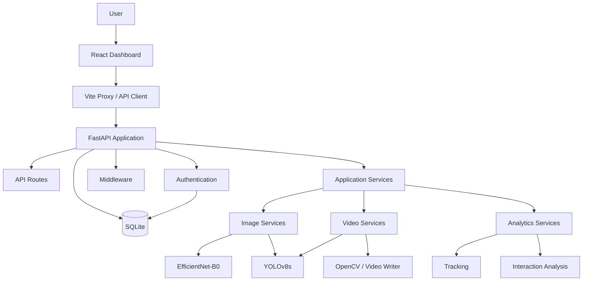

<div align="center">

# AI Visual Intelligence

**A full-stack computer vision platform for image understanding, video tracking, and interaction analytics.**

Turn visual data into structured results through classification, detection, tracking, analytics, authentication, and a React dashboard.

<br />

[](https://www.python.org/)
[](https://fastapi.tiangolo.com/)
[](https://react.dev/)
[](https://pytorch.org/)
[](https://docs.ultralytics.com/)
[](https://tailwindcss.com/)

</div>

---

## The idea

This project started as a computer vision API and grew into a complete application around it.

The models are only one part of the system. The rest of the work is about turning model output into something usable: validating uploads, exposing structured APIs, tracking objects across video frames, aggregating analytics, handling authentication and persistence, and presenting everything through a web interface.

```text
Visual input
    │
    ▼
Validation
    │
    ▼
AI inference
    │
    ▼
Structured results
    │
    ▼
Tracking & analytics
    │
    ▼
FastAPI
    │
    ▼
React dashboard
```

> The goal is not to demonstrate inference in isolation.  
> It is to build the application around it.

---

## What it does

| Area | Capability | Implementation |
| --- | --- | --- |
| Images | Image classification | EfficientNet-B0 + PyTorch |
| Images | Object detection | YOLOv8s |
| Images | Annotated detections | OpenCV |
| Images | Combined classification + detection | Unified analysis workflow |
| Video | Frame-by-frame detection | OpenCV + YOLOv8s |
| Video | Object tracking | Detection + tracking pipeline |
| Analytics | Track statistics | Analytics services |
| Analytics | Interaction partner / episode analysis | Track interaction analytics |
| Platform | Authentication | JWT + Argon2 |
| Platform | Persistence | SQLite + SQLAlchemy |
| Frontend | Interactive dashboard | React + Vite + Tailwind CSS |
| Quality | Backend + frontend tests | Pytest + Vitest |

---

## Image intelligence

### Classification

Image classification uses **EfficientNet-B0** through PyTorch / Torchvision.

The classifier returns:

- top predictions
- ImageNet class labels
- confidence scores
- inference timing
- structured API responses

The current model is a general-purpose ImageNet classifier rather than a custom domain-specific model.

<details>
<summary><strong>Example classification response</strong></summary>

```json
{
  "filename": "sample.jpg",
  "predictions": [
    {
      "label": "golden retriever",
      "confidence": 0.9376
    },
    {
      "label": "Labrador retriever",
      "confidence": 0.0042
    }
  ],
  "inference_time_ms": 42.31
}
```

</details>

### Object detection

Object detection is powered by **YOLOv8s**.

Each detection includes:

- class label
- confidence score
- bounding-box coordinates
- inference information

The `yolov8s.pt` weight file is stored locally in `models/`.

<details>
<summary><strong>Example detection response</strong></summary>

```json
{
  "filename": "sample.jpg",
  "content_type": "image/jpeg",
  "detections": [
    {
      "label": "dog",
      "confidence": 0.9342,
      "box": {
        "x1": 52.41,
        "y1": 31.22,
        "x2": 489.72,
        "y2": 421.63
      }
    }
  ]
}
```

</details>

### Combined analysis

Classification and detection can run in a single workflow.

```text
What does this image represent?
              +
Which objects are present?
```

That gives the application both image-level context and object-level information without requiring two separate user flows.

---

## Video intelligence

The video pipeline extends the same detection stack across time.

It supports:

- video uploads
- frame processing
- YOLOv8s detections
- object tracking
- annotated video generation
- detection statistics
- track statistics
- interaction analytics


```mermaid
flowchart LR
    A[Video Upload] --> B[Frame Processing]
    B --> C[YOLOv8s Detection]
    C --> D[Object Tracking]
    D --> E[Track IDs]
    E --> F[Track Analytics]
    F --> G[Interaction Analysis]
    G --> H[Dashboard]
```

### Detection vs. tracking

Detection answers **what is visible in a frame**.

Tracking adds the temporal layer: **which object is which across multiple frames**.

| Detection | Tracking |
| --- | --- |
| Finds objects in individual frames | Maintains identities across frames |
| Produces bounding boxes | Produces track IDs |
| Frame-level information | Temporal information |
| Individual detections | Track-level analytics |

Tracking makes it possible to calculate:

- total detections
- unique tracked objects
- per-track statistics
- object interactions
- interaction episodes

---

## Interaction analytics

A tracked object can also be treated as a node in an interaction network.

That lets the analytics layer move beyond raw bounding boxes and answer questions about relationships between tracks.

### Interaction partner count

How many distinct tracked objects interacted with each track?

```json
{
  "1": 2,
  "2": 2,
  "4": 2
}
```

### Interaction episode count

How many interaction episodes involved each track?

```json
{
  "1": 5,
  "2": 4,
  "4": 3
}
```

The result is a higher-level representation of what happened in the video rather than a long list of independent detections.

---

## Dashboard

The React frontend provides a UI for the computer vision workflows, so the system can be used without manually constructing API requests.

### Application areas

| Page | Purpose |
| --- | --- |
| Dashboard | Overview of images, videos, detections, and tracks |
| Image Analysis | Classification, detection, annotation, and combined analysis |
| Video Analysis | Video processing, detection, tracking, and analytics |
| Analytics | Detection, tracking, and interaction visualizations |
| Settings | User application preferences |

### Frontend stack

- React
- Vite
- Tailwind CSS
- Axios
- Lucide React

---

## Authentication

Authentication is handled by the FastAPI backend using JWT access tokens.


```mermaid
flowchart LR
    A[Login / Registration] --> B[FastAPI Auth]
    B --> C[JWT Access Token]
    C --> D[Browser Session]
    D --> E[Protected API Requests]
    E --> F[React Dashboard]
```

Implemented flows include:

- user registration
- user login
- Argon2 password hashing through `pwdlib`
- JWT access tokens
- protected API endpoints
- current-user retrieval
- session expiration handling

If a protected request returns `401 Unauthorized`, the frontend invalidates the current session and returns the user to the login interface.

---

## Architecture

The application is split into clear backend, frontend, inference, persistence, and analytics concerns.


```mermaid
flowchart TB
    U[User] --> F[React Dashboard]

    F --> N[Vite Proxy / API Client]
    N --> A[FastAPI Application]

    A --> R[API Routes]
    A --> AU[Authentication]
    A --> M[Middleware]
    A --> S[Application Services]
    A --> DB[(SQLite)]

    S --> I[Image Services]
    S --> V[Video Services]
    S --> AN[Analytics Services]

    I --> ML1[EfficientNet-B0]
    I --> ML2[YOLOv8s]

    V --> ML2
    V --> O[OpenCV / Video Writer]

    AN --> T[Tracking]
    AN --> IN[Interaction Analysis]

    AU --> DB
```

### Backend responsibilities

| Layer | Responsibility |
| --- | --- |
| API | HTTP requests and responses |
| Authentication | Password hashing, JWT generation, and validation |
| Database | SQLAlchemy engine, sessions, and initialization |
| Models | Structured application and response models |
| Services | AI inference, detection, annotation, video, and analytics logic |
| Middleware | Request-level infrastructure such as request IDs |

---

## Repository layout

```text
AI-Visual-Intelligence-API/
│
├── app/
│   ├── api/
│   │   ├── routes/
│   │   └── v1/
│   ├── auth/
│   ├── core/
│   ├── database/
│   ├── middleware/
│   ├── models/
│   ├── services/
│   └── main.py
│
├── frontend/
│   ├── src/
│   │   ├── components/
│   │   ├── pages/
│   │   ├── services/
│   │   ├── test/
│   │   ├── App.jsx
│   │   └── main.jsx
│   ├── package.json
│   └── vite.config.js
│
├── models/
│   ├── yolov8s.pt
│   ├── yolov8s-seg.pt
│   └── efficientnet_b0_rwightman-7f5810bc.pth
│
├── scripts/
├── tests/
├── requirements.txt
└── README.md
```

---

## Tech stack

| Layer | Technology |
| --- | --- |
| Backend | Python, FastAPI, Uvicorn |
| Frontend | React, Vite, JavaScript |
| Styling | Tailwind CSS |
| HTTP client | Axios |
| UI icons | Lucide React |
| Deep learning | PyTorch |
| Classification | EfficientNet-B0 |
| Detection | YOLOv8s |
| Computer vision | OpenCV |
| OCR | Tesseract |
| Database | SQLite |
| ORM | SQLAlchemy |
| Authentication | JWT |
| Password hashing | Argon2 / `pwdlib` |
| API docs | Swagger / OpenAPI |
| Backend testing | Pytest |
| Frontend testing | Vitest + React Testing Library |

---

## API

### Core endpoints

| Method | Endpoint | Purpose |
| --- | --- | --- |
| `GET` | `/` | API status |
| `GET` | `/health` | Health check |
| `POST` | `/predict` | Image classification |
| `POST` | `/detect` | Object detection |
| `POST` | `/detect/annotated` | Detection with annotated image |
| `POST` | `/analyze` | Combined image analysis |

Authentication and video functionality live in their respective route modules.

Once the backend is running, the complete API contract is available through FastAPI's generated documentation:

```text
Swagger  http://127.0.0.1:8000/docs
ReDoc    http://127.0.0.1:8000/redoc
```

---

## Run locally

### 1. Clone the repository

```powershell
git clone https://github.com/Debankumardas/AI-Visual-Intelligence-API.git
cd AI-Visual-Intelligence-API
```

### 2. Create the backend environment

```powershell
python -m venv .venv
.venv\Scripts\Activate.ps1
pip install -r requirements.txt
```

### 3. Configure environment variables

Create a `.env` file in the project root:

```env
JWT_SECRET_KEY=your-strong-secret-key
JWT_ALGORITHM=HS256
JWT_ACCESS_TOKEN_EXPIRE_MINUTES=60
DATABASE_URL=sqlite:///./app.db
```

Optional configuration:

| Variable | Default | Purpose |
| --- | --- | --- |
| `PRELOAD_MODELS` | `true` | Load AI models at startup; when `false`, load them on the first request |
| `VIDEO_MAX_PROCESSED_FRAMES` | `150` | Maximum number of analyzed frames per video |
| `MODELS_DIR` | `models` | Directory containing local model weights |

> Keep `JWT_SECRET_KEY` private and do not commit it to Git.

### 4. Initialize the database

```powershell
python -m app.database.init_db
```

### 5. Start the backend

```powershell
uvicorn app.main:app --reload
```

Backend:

```text
http://127.0.0.1:8000
```

### 6. Start the frontend

Open a second terminal:

```powershell
cd frontend
npm install
npm run dev
```

Frontend:

```text
http://localhost:5173
```

The Vite development server forwards `/api` and `/health` to the backend, keeping the browser on a single origin during local development.

Frontend environment variables:

| Variable | Default | Purpose |
| --- | --- | --- |
| `VITE_BACKEND_URL` | `http://127.0.0.1:8000` | Backend target for the development proxy |
| `VITE_API_BASE_URL` | `/` | Optional direct backend base URL |

See `frontend/.env.example` for the frontend environment configuration.

---

## Models and offline operation

Model weights live inside the repository's `models/` directory and are loaded from local files. The backend does not need to download weights at runtime.

| File | Used for |
| --- | --- |
| `yolov8s.pt` | Object detection and tracking |
| `yolov8s-seg.pt` | Instance segmentation |
| `efficientnet_b0_rwightman-7f5810bc.pth` | ImageNet classification |

Model sources and SHA-256 checksums are documented in `models/README.md`.

If a model file is missing or corrupted:

```powershell
python -m scripts.download_models
```

A missing weight file is surfaced through `/health/ready` with an explanatory error rather than crashing the API.

You can also point the application at a different model directory with `MODELS_DIR`.

### CPU-oriented defaults

The current development workflow does not require an NVIDIA GPU.

That choice shapes a few defaults:

- lightweight pretrained models
- CPU-compatible inference
- configurable processing
- a frame budget for video analysis

YOLOv8s provides a better accuracy / speed balance than smaller alternatives, but CPU video inference is still relatively expensive. Videos are therefore sampled down to at most `VIDEO_MAX_PROCESSED_FRAMES` processed frames.

---

## Testing

### Backend

```powershell
pytest
```

Backend coverage includes:

- API behavior
- authentication
- protected endpoints
- database functionality
- computer vision services
- video processing
- analytics
- error handling

### Frontend

```powershell
cd frontend
npm test
```

Frontend tests cover:

- component rendering
- authentication
- session restoration
- session expiration
- dashboard behavior
- navigation

### Lint

```powershell
npm run lint
```

### Production build

```powershell
npm run build
```

Frontend linting, tests, and the production build also run in CI.

---

## Security and validation

The current application includes:

- JWT authentication
- Argon2 password hashing
- protected API routes
- environment-based secrets
- session expiration
- input validation
- file type validation
- file size validation
- request ID middleware

Supported image types include:

- JPEG
- PNG
- WebP

Validation happens before expensive inference so malformed or unsupported requests can fail early.

For a larger production deployment, the project would still need infrastructure such as HTTPS, rate limiting, production secret management, a production database, security headers, monitoring, and role-based authorization.

---

## Current constraints

This is a working full-stack project, but it is intentionally scoped.

| Area | Current constraint |
| --- | --- |
| Classification | EfficientNet-B0 uses general ImageNet classes |
| Detection | YOLOv8s balances accuracy and CPU speed; larger models cost more compute |
| Hardware | CPU inference is slower than GPU inference |
| Video | Long or high-resolution videos are computationally expensive |
| Database | SQLite is aimed at local and portfolio-scale usage |
| Deployment | Local development is configured; production hosting is not included |

---

## Roadmap

- [ ] GPU inference support
- [ ] PostgreSQL + Alembic migrations
- [ ] Asynchronous video processing and background jobs
- [ ] Cloud deployment
- [ ] Custom-trained computer vision models
- [ ] Model benchmarking and performance optimization
- [ ] API rate limiting and advanced authorization
- [ ] Monitoring and observability
- [ ] Scalable inference workers
- [ ] Real-time camera and WebSocket-based detection

---

## Why this project matters

A model demo can stop at:

```text
input → model → prediction
```

This project keeps going:

```text
raw visual data
      ↓
validation
      ↓
AI inference
      ↓
structured results
      ↓
tracking & analytics
      ↓
REST API
      ↓
authentication + persistence
      ↓
React dashboard
```

That integration is the point of the repository.

It brings computer vision together with backend engineering, frontend development, authentication, persistence, testing, validation, and application architecture in one system.

---

## Authors

**Deban Kumar Das D**  
BCA — Data Science

GitHub: [@Debankumardas](https://github.com/Debankumardas)

**Pranav S Nair**

GitHub: [@p04pranav](https://github.com/p04pranav)

---

## License

This project is intended for educational, learning, research, and portfolio purposes.

---

<div align="center">

If this project is useful to you, consider giving the repository a star.

</div>
