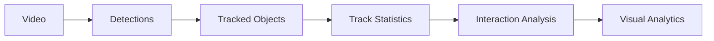
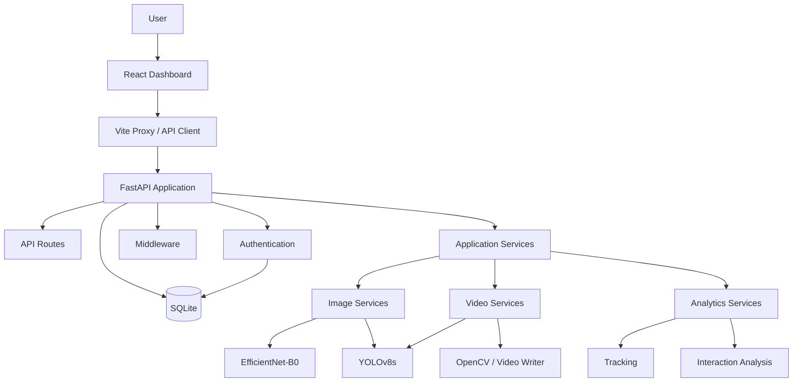
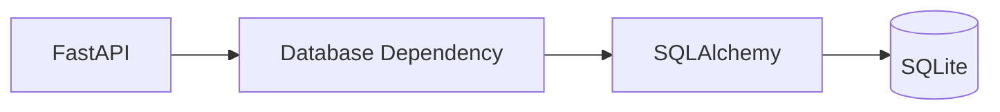

# 👁️ AI Visual Intelligence Platform

> **A full-stack computer vision platform that transforms images and videos into structured visual intelligence through AI inference, object detection, tracking, analytics, authentication, and an interactive React dashboard.**

[](https://www.python.org/)
[](https://fastapi.tiangolo.com/)
[](https://react.dev/)
[](https://pytorch.org/)
[](https://docs.ultralytics.com/)
[](https://tailwindcss.com/)

---

## ✨ What Is This?

**AI Visual Intelligence Platform** started as an API-first computer vision project and evolved into a complete application around image understanding, video intelligence, object tracking, interaction analytics, authentication, persistence, and dashboard visualization.

Instead of exposing raw model inference directly, the platform wraps computer vision capabilities inside a modular software architecture:

```text
Visual Data
     ↓
Validation
     ↓
AI Inference
     ↓
Structured Results
     ↓
Analytics
     ↓
FastAPI
     ↓
React Dashboard
     ↓
User
```

The project combines:

* 🧠 **Image classification** with EfficientNet-B0
* 🎯 **Object detection** with YOLOv8s
* 🖍️ **Annotated image generation**
* 🎥 **Video processing**
* 🧭 **Object tracking**
* 📊 **Video and track analytics**
* 🕸️ **Interaction network analysis**
* 🔐 **JWT authentication**
* 👤 **User preferences**
* 🗄️ **SQLite + SQLAlchemy persistence**
* 🖥️ **React dashboard**
* 🧪 **Backend and frontend testing**
* 📦 **Offline model weights** stored in the `models/` folder

---

## 🚀 Core Capabilities

| Capability                | Description                                                                     | Technology                |
| ------------------------- | ------------------------------------------------------------------------------- | ------------------------- |
| 🖼️ Image Classification  | General-purpose image classification with top predictions and confidence scores | EfficientNet-B0 + PyTorch |
| 🎯 Object Detection       | Detect objects, labels, confidence and bounding boxes                           | YOLOv8s                   |
| 🖍️ Annotation            | Generate images with detected objects visually marked                           | OpenCV                    |
| 🔍 Combined Analysis      | Run classification and detection in one workflow                                | EfficientNet-B0 + YOLOv8s |
| 🎥 Video Intelligence     | Process uploaded videos frame-by-frame                                          | OpenCV + YOLOv8s          |
| 🧭 Object Tracking        | Maintain tracked object identities across frames                                | Detection + tracking      |
| 📊 Video Analytics        | Aggregate detection and tracking information                                    | Analytics services        |
| 🕸️ Interaction Analytics | Analyze interaction partners and interaction episodes                           | Track analytics           |
| 🔐 Authentication         | Registration, login, JWT sessions and protected APIs                            | FastAPI + JWT + Argon2    |
| 🖥️ Dashboard             | Interact with AI services through a web interface                               | React + Vite + Tailwind   |

---

# 🧠 AI & Computer Vision

## 1. Image Classification

The platform uses **EfficientNet-B0 through PyTorch/Torchvision** for image classification.

The classification pipeline returns:

* Top predictions
* ImageNet class labels
* Confidence scores
* Inference timing
* Structured API responses

The current classifier uses **ImageNet classes**, so it is intended as a general-purpose computer vision demonstration rather than a custom domain-specific classifier.

<details>
<summary>Example response</summary>

```json
{
  "filename": "sample.jpg",
  "predictions": [
    {
      "label": "golden retriever",
      "confidence": 0.9376
    },
    {
      "label": "Labrador retriever",
      "confidence": 0.0042
    }
  ],
  "inference_time_ms": 42.31
}
```

</details>

---

## 2. Object Detection

Object detection is powered by **YOLOv8s**.

The detector provides:

* Object labels
* Confidence scores
* Bounding-box coordinates
* Detection results
* Inference information

The `yolov8s.pt` model is included in the `models/` folder.

<details>
<summary>Example response</summary>

```json
{
  "filename": "sample.jpg",
  "content_type": "image/jpeg",
  "detections": [
    {
      "label": "dog",
      "confidence": 0.9342,
      "box": {
        "x1": 52.41,
        "y1": 31.22,
        "x2": 489.72,
        "y2": 421.63
      }
    }
  ]
}
```

</details>

---

## 3. Combined Image Analysis

Classification and object detection can be executed through a unified analysis workflow.

This allows the system to answer two different questions from the same image:

```text
What does the image represent?
             +
Which objects are present?
```

---

# 🎥 Video Intelligence

The platform extends computer vision from individual images to video.

The video pipeline supports:

* Video uploads
* Frame processing
* YOLOv8s detection
* Object tracking
* Annotated video generation
* Detection statistics
* Track statistics
* Video analytics
* Interaction analytics

### Video Pipeline


```mermaid
flowchart LR
    A[Video Upload] --> B[Frame Processing]
    B --> C[YOLOv8s Detection]
    C --> D[Object Tracking]
    D --> E[Track IDs]
    E --> F[Track Analytics]
    F --> G[Interaction Analysis]
    G --> H[Dashboard Visualization]
```

---

## 🧭 Object Tracking

Object detection identifies objects independently within frames.

Tracking adds temporal information by attempting to maintain object identities across multiple frames.

| Detection               | Tracking                    |
| ----------------------- | --------------------------- |
| Finds objects in frames | Maintains object identities |
| Bounding boxes          | Track IDs                   |
| Frame-level information | Temporal information        |
| Individual detections   | Track-level analytics       |

Tracking enables the platform to analyze:

* Total detections
* Unique tracked objects
* Track statistics
* Object interactions
* Interaction episodes

---

## 📊 Video Analytics

The analytics layer converts frame-level detections into higher-level information.

Current analytics include:

* Total detections
* Unique track IDs
* Track statistics
* Interaction statistics
* Interaction partner counts
* Interaction episode counts


```mermaid
flowchart LR
    A[Video] --> B[Detections]
    B --> C[Tracked Objects]
    C --> D[Track Statistics]
    D --> E[Interaction Analysis]
    E --> F[Visual Analytics]
```

---

## 🕸️ Track Interaction Network

One of the platform's more advanced analytics components is the **Track Interaction Network**.

Tracked objects can be represented as nodes in an interaction network. The analytics service can calculate:

### Interaction Partner Count

The number of distinct objects that interacted with each tracked object.

Example:

```json
{
  "1": 2,
  "2": 2,
  "4": 2
}
```

### Interaction Episode Count

The number of interaction episodes involving each tracked object.

Example:

```json
{
  "1": 5,
  "2": 4,
  "4": 3
}
```

This converts raw tracking information into higher-level interaction information that can be visualized through the analytics dashboard.

---

# 🖥️ React Dashboard

The project includes a dedicated React frontend so users can interact with the computer vision system without manually constructing API requests.

### Frontend Stack

* React
* Vite
* Tailwind CSS
* Axios
* Lucide React

### Application Areas

| Page           | Purpose                                             |
| -------------- | --------------------------------------------------- |
| Dashboard      | Overview of images, videos, detections and tracks   |
| Image Analysis | Image-based computer vision operations              |
| Video Analysis | Video processing, detection, tracking and analytics |
| Analytics      | Detection, tracking and interaction visualization   |
| Settings       | User application preferences                        |

---

## 🔐 Authentication Flow

The frontend and backend use JWT-based authentication.


```mermaid
flowchart LR
    A[Login / Registration] --> B[FastAPI Authentication]
    B --> C[JWT Access Token]
    C --> D[Browser Session]
    D --> E[Protected API Requests]
    E --> F[React Dashboard]
```

Authentication includes:

* User registration
* User login
* Argon2 password hashing through `pwdlib`
* JWT access tokens
* Protected API endpoints
* Current-user retrieval
* Session expiration handling

If a protected API request returns `401 Unauthorized`, the frontend invalidates the current session and returns the user to the login interface.

---

# 🏗️ System Architecture

The platform follows a modular architecture separating presentation, API routing, authentication, persistence, AI inference, video processing and analytics.


```mermaid
flowchart TB
    U[User] --> F[React Dashboard]

    F --> N[Vite Proxy / API Client]
    N --> A[FastAPI Application]

    A --> R[API Routes]
    A --> AU[Authentication]
    A --> M[Middleware]
    A --> S[Application Services]
    A --> DB[(SQLite)]

    S --> I[Image Services]
    S --> V[Video Services]
    S --> AN[Analytics Services]

    I --> ML1[EfficientNet-B0]
    I --> ML2[YOLOv8s]

    V --> ML2
    V --> O[OpenCV / Video Writer]

    AN --> T[Tracking]
    AN --> IN[Interaction Analysis]

    AU --> DB
```

### Backend Layers

| Layer          | Responsibility                                                 |
| -------------- | -------------------------------------------------------------- |
| API            | HTTP requests and responses                                    |
| Authentication | Password hashing, JWT generation and validation                |
| Database       | SQLAlchemy engine, sessions and initialization                 |
| Models         | Structured application and response models                     |
| Services       | AI inference, detection, annotation, video and analytics logic |
| Middleware     | Request-level infrastructure such as request IDs               |

---

# 📁 Project Structure

The repository is organized around separate backend, frontend and model concerns.

```text
AI-Visual-Intelligence-API/
│
├── app/
│   ├── api/
│   │   ├── routes/
│   │   └── v1/
│   ├── auth/
│   ├── core/
│   ├── database/
│   ├── middleware/
│   ├── models/
│   ├── services/
│   └── main.py
│
├── frontend/
│   ├── src/
│   │   ├── components/
│   │   ├── pages/
│   │   ├── services/
│   │   ├── test/
│   │   ├── App.jsx
│   │   └── main.jsx
│   ├── package.json
│   └── vite.config.js
│
├── models/
│   ├── yolov8s.pt
│   ├── yolov8s-seg.pt
│   └── efficientnet_b0_rwightman-7f5810bc.pth
│
├── scripts/
├── tests/
├── requirements.txt
└── README.md
```

---

# ⚙️ Technology Stack

| Layer             | Technologies                   |
| ----------------- | ------------------------------ |
| Backend           | Python, FastAPI, Uvicorn       |
| Frontend          | React, Vite, JavaScript        |
| Styling           | Tailwind CSS                   |
| HTTP Client       | Axios                          |
| UI                | Lucide React                   |
| Deep Learning     | PyTorch                        |
| Classification    | EfficientNet-B0                |
| Detection         | YOLOv8s                        |
| Computer Vision   | OpenCV                         |
| OCR               | Tesseract                      |
| Database          | SQLite                         |
| ORM               | SQLAlchemy                     |
| Authentication    | JWT                            |
| Password Hashing  | Argon2 / `pwdlib`              |
| API Documentation | Swagger / OpenAPI              |
| Backend Testing   | Pytest                         |
| Frontend Testing  | Vitest + React Testing Library |

---

# 🔌 API

The backend exposes functionality for:

* Health checks
* Authentication
* Image classification
* Object detection
* Annotated detection
* Combined image analysis
* Video processing
* Video analytics

### Core Endpoints

| Method | Endpoint            | Purpose                        |
| ------ | ------------------- | ------------------------------ |
| `GET`  | `/`                 | API status                     |
| `GET`  | `/health`           | Health check                   |
| `POST` | `/predict`          | Image classification           |
| `POST` | `/detect`           | Object detection               |
| `POST` | `/detect/annotated` | Detection with annotated image |
| `POST` | `/analyze`          | Combined image analysis        |

Authentication and video functionality are exposed through their respective route modules.

For the complete API contract, use the automatically generated FastAPI documentation.

---

# 📚 API Documentation

Once the backend is running:

**Swagger**

```text
http://127.0.0.1:8000/docs
```

**ReDoc**

```text
http://127.0.0.1:8000/redoc
```

Swagger provides an interactive interface for inspecting and testing API requests.

---

# 💻 Local Development

## 1. Clone

```powershell
git clone https://github.com/Debankumardas/AI-Visual-Intelligence-API.git
cd AI-Visual-Intelligence-API
```

## 2. Backend Environment

```powershell
python -m venv .venv
.venv\Scripts\Activate.ps1
```

Install dependencies:

```powershell
pip install -r requirements.txt
```

## 3. Configure Environment

Create a `.env` file in the project root.

```env
JWT_SECRET_KEY=your-strong-secret-key
JWT_ALGORITHM=HS256
JWT_ACCESS_TOKEN_EXPIRE_MINUTES=60
DATABASE_URL=sqlite:///./app.db
```

Optional settings:

| Variable                     | Default | Purpose                                                                                      |
| ---------------------------- | ------- | -------------------------------------------------------------------------------------------- |
| `PRELOAD_MODELS`             | `true`  | Load the AI models at startup. When `false`, they load on the first request.                 |
| `VIDEO_MAX_PROCESSED_FRAMES` | `150`   | Maximum frames analysed per video. Longer videos are sampled evenly with a larger stride.    |
| `MODELS_DIR`                 | `models` | Folder containing the model weights.                                                         |

> Keep `JWT_SECRET_KEY` private and never commit it to Git.

## 4. Initialize Database

```powershell
python -m app.database.init_db
```

## 5. Start Backend

```powershell
uvicorn app.main:app --reload
```

Backend:

```text
http://127.0.0.1:8000
```

---

# 🖥️ Frontend Development

Open a second terminal:

```powershell
cd frontend
npm install
npm run dev
```

Frontend:

```text
http://localhost:5173
```

Open `http://localhost:5173`. The Vite dev server forwards `/api` and `/health`
to the backend, so the browser stays on a single origin and no CORS setup is
needed.

| Variable            | Default                 | Purpose                                                                    |
| ------------------- | ----------------------- | -------------------------------------------------------------------------- |
| `VITE_BACKEND_URL`  | `http://127.0.0.1:8000` | Where the dev server forwards `/api` and `/health` requests.               |
| `VITE_API_BASE_URL` | `/`                     | Optional. Call a backend directly (it must then allow this origin in CORS). |

See `frontend/.env.example`. `npm run preview` uses the same proxy to serve the
production build locally.

---

# 🧪 Testing & Quality

The project includes automated backend and frontend testing.

### Backend

```powershell
pytest
```

Backend coverage includes areas such as:

* API behavior
* Authentication
* Protected endpoints
* Database functionality
* Computer vision services
* Video processing
* Analytics
* Error handling

### Frontend

```powershell
cd frontend
npm test
```

Frontend tests cover areas such as:

* Component rendering
* Authentication
* Session restoration
* Session expiration
* Dashboard behavior
* Navigation

### Lint

```powershell
npm run lint
```

Frontend lint, tests and the production build also run in CI.

### Production Build

```powershell
npm run build
```

---

# 📦 Models

All model weights are stored in the [`models/`](models) folder and loaded from
local files, so the backend works fully offline. Nothing is downloaded at
runtime.

| File                                     | Used for                        |
| ---------------------------------------- | ------------------------------- |
| `yolov8s.pt`                             | Object detection and tracking   |
| `yolov8s-seg.pt`                         | Instance segmentation           |
| `efficientnet_b0_rwightman-7f5810bc.pth` | Image classification (ImageNet) |

Sources and SHA-256 checksums are listed in [`models/README.md`](models/README.md).
If a file is missing or corrupted, restore and verify it with:

```powershell
python -m scripts.download_models
```

A missing weight file is reported by `/health/ready` with an explanatory error
instead of crashing the API. Set `MODELS_DIR` to load the weights from another
folder.

YOLOv8s is more accurate than the smaller YOLOv8n/YOLO11n models but slower on
CPU (about 0.6 s per frame on a 2-core machine). Videos are therefore sampled
down to at most `VIDEO_MAX_PROCESSED_FRAMES` frames.

---

# 🔒 Security & Validation

The platform includes several security and reliability mechanisms:

* JWT authentication
* Argon2 password hashing
* Protected API routes
* Environment-based secrets
* Session expiration
* Input validation
* File type validation
* File size validation
* Request ID middleware

Supported image types include:

* JPEG
* PNG
* WebP

Validation occurs before expensive inference so invalid requests can be rejected early.

For larger production deployments, additional infrastructure such as HTTPS, rate limiting, secure secret management, production databases, security headers, monitoring and role-based authorization would be appropriate.

---

# ⚡ CPU-Oriented Design

The project is designed to operate on CPU hardware and does not require an NVIDIA GPU for its current development workflow.

The architecture therefore prioritizes:

* Lightweight models
* Modular inference services
* Configurable processing
* CPU compatibility

GPU acceleration can significantly improve inference performance for larger workloads.

---

# 🗄️ Database

The current persistence layer uses:

* SQLite
* SQLAlchemy

Persistent application information includes:

* Users
* User preferences


```mermaid
flowchart LR
    A[FastAPI] --> B[Database Dependency]
    B --> C[SQLAlchemy]
    C --> D[(SQLite)]
```

SQLite is appropriate for local development, demonstrations and portfolio-scale usage.

For higher-concurrency production workloads, PostgreSQL would be a stronger choice.

---

# 📈 Development Evolution

The project evolved from a simple computer vision API into a broader full-stack platform.

| Stage                           | Evolution                                                                     |
| ------------------------------- | ----------------------------------------------------------------------------- |
| **1 — Image AI API**            | Classification, detection and REST API                                        |
| **2 — Production Backend**      | Validation, errors, logging, request IDs and testing                          |
| **3 — Video Intelligence**      | Video processing, detection, tracking and annotated video                     |
| **4 — Advanced Analytics**      | Track analytics, interaction analysis and interaction networks                |
| **5 — Full-Stack Application**  | React dashboard, authentication, preferences, database and session management |
| **6 — Hardening**               | Offline model weights, non-blocking inference and a video frame budget        |

---

# 🎯 Current Platform

The current system brings together three major areas:

```text
                    AI VISUAL INTELLIGENCE
                              │
             ┌────────────────┼────────────────┐
             │                │                │
             ▼                ▼                ▼
          IMAGES           VIDEOS          ANALYTICS
             │                │                │
       ┌─────┼─────┐     ┌────┼────┐      ┌───┼────┐
       ▼     ▼     ▼     ▼         ▼      ▼        ▼
    Class  Detect Annotate Detect Track  Tracks  Interactions
       │            │       │      │      │        │
       └────────────┴───────┴──────┴──────┴────────┘
                              │
                              ▼
                       FastAPI Backend
                         │         │
                         ▼         ▼
                  Authentication  Database
                         │         │
                         └────┬────┘
                              ▼
                       React Dashboard
```

---

# ⚠️ Current Limitations

| Area           | Current Limitation                                                                                     |
| -------------- | ------------------------------------------------------------------------------------------------------ |
| Classification | EfficientNet-B0 currently performs general ImageNet classification                                     |
| Detection      | YOLOv8s balances accuracy and CPU speed; larger models are more accurate but much slower on CPU       |
| Hardware       | CPU inference is slower than GPU inference                                                             |
| Video          | Long or high-resolution videos can become computationally expensive                                    |
| Database       | SQLite is intended for local and portfolio-scale usage                                                 |
| Deployment     | The app is set up for local use; production hosting (HTTPS, process management) is not included       |

---

# 🔮 Roadmap

Potential future development includes:

* [ ] GPU inference support
* [ ] PostgreSQL + Alembic migrations
* [ ] Asynchronous video processing and background jobs
* [ ] Cloud deployment
* [ ] Custom-trained computer vision models
* [ ] Model benchmarking and performance optimization
* [ ] API rate limiting and advanced authorization
* [ ] Monitoring and observability
* [ ] Scalable inference workers
* [ ] Real-time camera and WebSocket-based detection

---

# 🏆 Engineering Highlights

This project demonstrates the integration of AI models with practical software engineering rather than treating model inference as an isolated script.

### Artificial Intelligence

* Computer vision
* Image classification
* Object detection
* Object tracking
* Video analytics
* Interaction analysis

### Backend Engineering

* FastAPI
* REST API design
* Modular service architecture
* Request validation
* Error handling
* Middleware
* OpenAPI documentation

### Security & Data

* JWT authentication
* Argon2 password hashing
* Protected endpoints
* Environment-based secrets
* SQLAlchemy
* Persistent user data

### Frontend Engineering

* React
* Vite
* Tailwind CSS
* Axios
* Component-based architecture
* Dashboard development
* Authentication flows

### Testing & Quality

* Pytest
* Vitest
* React Testing Library
* GitHub Actions CI

---

# 📌 Engineering Principle

The central idea behind the project is simple:

> **Turn standalone AI inference into a complete, modular and user-facing software system.**

```text
Raw Visual Data
      ↓
Validation
      ↓
AI Inference
      ↓
Structured Results
      ↓
Analytics
      ↓
REST API
      ↓
React Dashboard
      ↓
User
```

The project demonstrates how pretrained computer vision models can be integrated with backend engineering, frontend development, authentication, persistence, testing and deployment architecture.

---

# 📚 API Documentation

FastAPI automatically generates interactive API documentation.

After starting the backend:

**Swagger:** `http://127.0.0.1:8000/docs`

**ReDoc:** `http://127.0.0.1:8000/redoc`

---

# 👨‍💻 Author

**Deban Kumar Das D**

BCA — Data Science

GitHub: [@Debankumardas](https://github.com/Debankumardas)

---

## 📄 License

This project is intended for educational, learning, research and portfolio purposes.

---

⭐ **If you find the project useful, consider starring the repository.**
