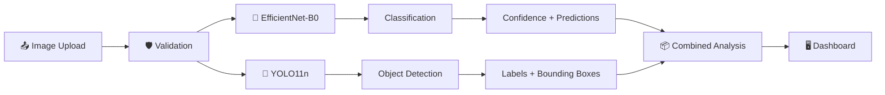
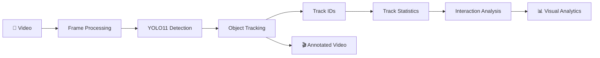
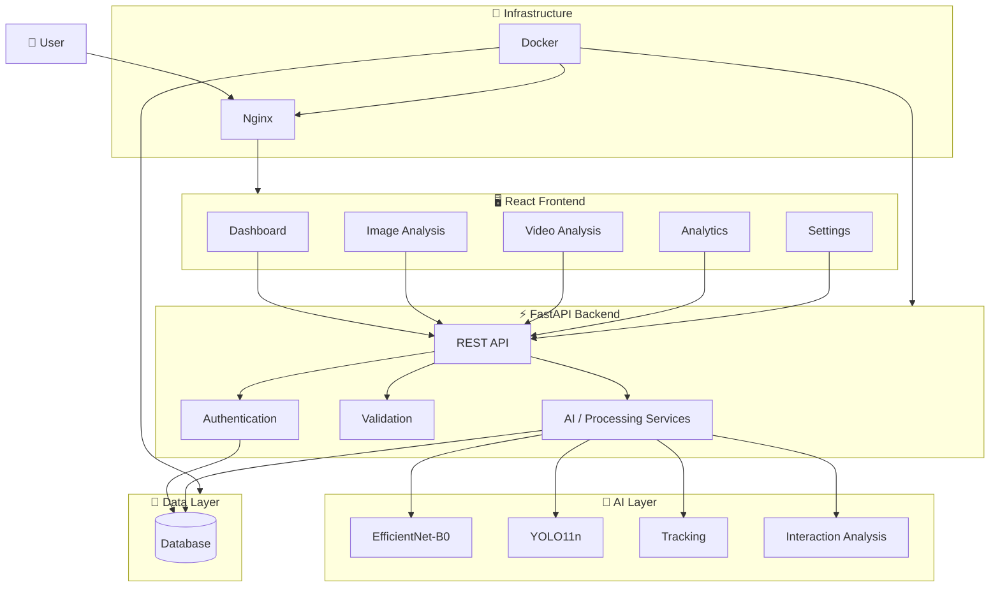
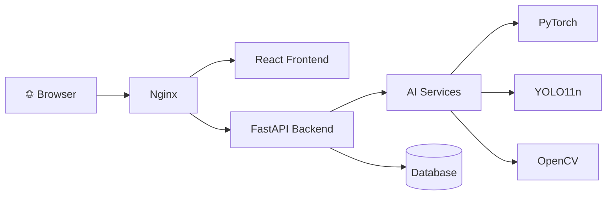

<div align="center">

# 👁️ AI Visual Intelligence Platform

### **Full-Stack Computer Vision · Video Intelligence · AI Analytics**

AI-powered platform for **image understanding, object detection, video tracking, interaction analysis, and visual analytics** — built as a complete application rather than a standalone model demo.

<br>

[](https://www.python.org/)
[](https://fastapi.tiangolo.com/)
[](https://react.dev/)
[](https://pytorch.org/)
[](https://docs.ultralytics.com/)
[](https://www.docker.com/)

<br>

[](https://github.com/Debankumardas/AI-Visual-Intelligence-API)

</div>

---

## ✨ What It Does

**AI Visual Intelligence Platform** turns computer vision models into a complete application for analyzing visual data.

### Core capabilities

| Capability                       | What it provides                                               |
| -------------------------------- | -------------------------------------------------------------- |
| 🖼️ **Image Classification**     | Image-level predictions using EfficientNet-B0                  |
| 🎯 **Object Detection**          | Object labels, confidence scores and bounding boxes            |
| 🎥 **Video Intelligence**        | Frame-level detection and video processing                     |
| 🧭 **Object Tracking**           | Persistent object identities across video frames               |
| 📊 **Video Analytics**           | Detection, track and interaction statistics                    |
| 🕸️ **Interaction Intelligence** | Relationships and interaction episodes between tracked objects |
| 🔐 **Authentication**            | JWT-based authentication with protected routes                 |
| 💾 **Persistence**               | Database-backed application data                               |
| 🖥️ **Web Dashboard**            | React-based interface for visual analysis                      |
| 🐳 **Deployment**                | Docker-based application setup                                 |

---

# 🖥️ Product

The platform is designed around a simple idea:

> **Turn visual AI models into an application that people can actually use.**

Instead of exposing a model through a single script, the project combines:

```text
Computer Vision
      ↓
Inference Services
      ↓
FastAPI Backend
      ↓
Authentication + Persistence
      ↓
React Dashboard
      ↓
Visual Analytics
```

This makes the project closer to an **AI application architecture** than a simple machine-learning experiment.

---

# 📸 Screenshots

> Add your actual application screenshots here once finalized.

### Dashboard

```text
[ Add Dashboard Screenshot ]
```

### Image Analysis

```text
[ Add Image Analysis Screenshot ]
```

### Video Intelligence

```text
[ Add Video Analysis Screenshot ]
```

### Analytics

```text
[ Add Analytics / Interaction Network Screenshot ]
```

> **Recommendation:** Use 4–5 real screenshots here. For a visual AI project, screenshots communicate the product far better than several paragraphs of explanation.

---

# 🧠 Core AI Capabilities

## 🖼️ Image Intelligence

The image pipeline supports both semantic classification and object-level detection.

### Classification

**EfficientNet-B0** is used for image classification and produces ranked predictions with confidence information.

### Detection

**YOLO11n** is used for object detection and provides:

* Object labels
* Confidence scores
* Bounding boxes
* Detection results
* Annotated visual output

### Combined Analysis

The platform can combine classification and detection within the same image-analysis workflow.


```mermaid
flowchart LR

    A[📤 Image Upload] --> B[🛡️ Validation]

    B --> C[🧠 EfficientNet-B0]
    B --> D[🎯 YOLO11n]

    C --> E[Classification]
    D --> F[Object Detection]

    E --> G[Confidence + Predictions]
    F --> H[Labels + Bounding Boxes]

    G --> I[📦 Combined Analysis]
    H --> I

    I --> J[🖥️ Dashboard]
```

---

# 🎥 Video Intelligence

Video analysis extends the project beyond single-image inference.

The pipeline processes video frames and applies computer vision models to extract temporal information.

### Processing flow


```mermaid
flowchart LR

    A[🎥 Video] --> B[Frame Processing]

    B --> C[YOLO11 Detection]

    C --> D[Object Tracking]

    D --> E[Track IDs]

    E --> F[Track Statistics]

    F --> G[Interaction Analysis]

    G --> H[📊 Visual Analytics]

    D --> I[🎬 Annotated Video]
```

### Video capabilities

* Video upload and processing
* Frame-level object detection
* Object tracking
* Persistent track identities
* Detection statistics
* Track statistics
* Interaction analysis
* Annotated visual output
* Analytics visualization

---

# 🧭 Object Tracking

Detection answers:

> **“What objects are present in this frame?”**

Tracking extends that to:

> **“Which detected object is the same object across multiple frames?”**

| Detection               | Tracking                  |
| ----------------------- | ------------------------- |
| Finds objects           | Maintains object identity |
| Bounding boxes          | Track IDs                 |
| Frame-level information | Temporal information      |
| Spatial understanding   | Movement across frames    |

This temporal layer enables higher-level analytics that cannot be obtained from isolated image detection.

---

# 🕸️ Interaction Intelligence

One of the more advanced parts of the platform is the ability to move beyond simple object detection and analyze **relationships between tracked objects**.

The general flow is:

```mermaid
flowchart TD

    A[Video Frames]
        ↓
    B[Object Detection]
        ↓
    C[Object Tracking]
        ↓
    D[Track Identities]
        ↓
    E[Spatial / Temporal Relationships]
        ↓
    F[Interaction Episodes]
        ↓
    G[Interaction Statistics]
        ↓
    H[Visual Analytics]
```

This allows the system to derive information such as:

* Number of tracked objects
* Interaction partners
* Interaction counts
* Interaction episodes
* Track-level statistics
* Relationship-oriented visualizations

The goal is to transform raw detections into **higher-level visual intelligence**.

---

# 🏗️ Architecture

The platform follows a layered architecture that separates the user interface, API, AI services, data layer and infrastructure.


```mermaid
flowchart TB

    U[👤 User]

    subgraph Frontend["🖥️ React Frontend"]
        UI[Dashboard]
        IMG[Image Analysis]
        VID[Video Analysis]
        ANA[Analytics]
        SET[Settings]
    end

    subgraph Backend["⚡ FastAPI Backend"]
        API[REST API]
        AUTH[Authentication]
        VALID[Validation]
        SERVICES[AI / Processing Services]
    end

    subgraph AI["🧠 AI Layer"]
        EFF[EfficientNet-B0]
        YOLO[YOLO11n]
        TRACK[Tracking]
        INTERACT[Interaction Analysis]
    end

    subgraph Data["💾 Data Layer"]
        DB[(Database)]
    end

    subgraph Infra["🐳 Infrastructure"]
        DOCKER[Docker]
        NGINX[Nginx]
    end

    U --> NGINX
    NGINX --> Frontend

    UI --> API
    IMG --> API
    VID --> API
    ANA --> API
    SET --> API

    API --> AUTH
    API --> VALID
    API --> SERVICES

    SERVICES --> EFF
    SERVICES --> YOLO
    SERVICES --> TRACK
    SERVICES --> INTERACT

    AUTH --> DB
    SERVICES --> DB

    DOCKER --> NGINX
    DOCKER --> Backend
    DOCKER --> Data
```

---

# 🔐 Authentication & Data

The upgraded platform includes application-level authentication and persistence.

### Authentication flow


```mermaid
flowchart LR

    A[Registration / Login]
        --> B[Password Hashing]

    B --> C[JWT Authentication]

    C --> D[Authenticated Session]

    D --> E[Protected API Requests]

    E --> F[Dashboard / AI Features]
```

### Security components

* JWT-based authentication
* Password hashing with Argon2
* Protected API routes
* Session handling
* Environment-based secrets
* Input validation

### Database

The application uses a database layer for persistent application data.

The architecture keeps the database behind the backend rather than allowing the frontend to access it directly.

```text
React
  ↓
FastAPI
  ↓
Database Layer
  ↓
Persistent Data
```

SQLite is suitable for local development, demonstrations and portfolio-scale workloads. A production deployment can move to a server-grade relational database when higher concurrency and operational requirements demand it.

---

# 🖥️ Frontend

The React frontend provides the user-facing layer for interacting with the platform.

| Page               | Purpose                                      |
| ------------------ | -------------------------------------------- |
| **Dashboard**      | Application overview                         |
| **Image Analysis** | Image-based AI inference                     |
| **Video Analysis** | Video processing and tracking                |
| **Analytics**      | Detection, tracking and interaction insights |
| **Settings**       | User/application preferences                 |
| **Authentication** | Login and account access                     |

The frontend communicates with the backend through the API layer rather than directly interacting with AI models or the database.

---

# 🧰 Technology Stack

| Layer                  | Technologies                   |
| ---------------------- | ------------------------------ |
| **Frontend**           | React, Vite, Tailwind CSS      |
| **Backend**            | Python, FastAPI, Uvicorn       |
| **AI / Deep Learning** | PyTorch, Torchvision           |
| **Classification**     | EfficientNet-B0                |
| **Detection**          | YOLO11n                        |
| **Computer Vision**    | OpenCV                         |
| **Tracking**           | Object tracking pipeline       |
| **Analytics**          | Python-based visual analytics  |
| **Authentication**     | JWT, Argon2                    |
| **Database**           | SQLite, SQLAlchemy             |
| **Testing**            | Pytest, frontend testing tools |
| **Infrastructure**     | Docker, Docker Compose, Nginx  |
| **CI/CD**              | GitHub Actions                 |
| **Version Control**    | Git, GitHub                    |

---

# 📁 Project Structure

The repository is organized into separate application layers rather than putting the complete system into one file.

```text
AI-Visual-Intelligence-API/
│
├── .github/
│   └── workflows/
│
├── app/
│   ├── api/
│   ├── auth/
│   ├── core/
│   ├── database/
│   ├── middleware/
│   ├── models/
│   └── services/
│
├── frontend/
│   ├── components/
│   ├── pages/
│   ├── services/
│   └── tests/
│
├── tests/
│
├── Dockerfile
├── docker-compose.yml
├── .env.example
├── requirements.txt
├── run.py
└── README.md
```

### Architectural separation

```text
Frontend
    ↓
API Routes
    ↓
Authentication / Validation
    ↓
Service Layer
    ↓
AI / Video Processing
    ↓
Database
```

This separation makes individual components easier to test, replace and extend.

---

# 🔌 API

The backend exposes a REST API through FastAPI.

### Core API operations

| Method | Endpoint            | Purpose                    |
| ------ | ------------------- | -------------------------- |
| `GET`  | `/health`           | Health check               |
| `POST` | `/predict`          | Image classification       |
| `POST` | `/detect`           | Object detection           |
| `POST` | `/detect/annotated` | Detection with annotations |
| `POST` | `/analyze`          | Combined image analysis    |

Additional application endpoints support authentication, video processing, analytics and other platform functionality.

### API documentation

When running locally, FastAPI provides interactive documentation at:

```text
http://127.0.0.1:8000/docs
```

and:

```text
http://127.0.0.1:8000/redoc
```

The Swagger interface can be used to explore and test the API directly.

---

# ⚙️ Local Development

## 1. Clone

```powershell
git clone https://github.com/Debankumardas/AI-Visual-Intelligence-API.git

cd AI-Visual-Intelligence-API
```

## 2. Create virtual environment

```powershell
python -m venv .venv
```

## 3. Activate

### Windows PowerShell

```powershell
.venv\Scripts\Activate.ps1
```

## 4. Install backend dependencies

```powershell
pip install -r requirements.txt
```

## 5. Configure environment

If `.env.example` is available:

```powershell
Copy-Item .env.example .env
```

Update the required environment variables before starting the application.

> Never commit production secrets, passwords or tokens to GitHub.

---

# ▶️ Running the Application

## Backend

Start the FastAPI application using the project's configured startup command.

```powershell
python run.py
```

The backend is typically available at:

```text
http://127.0.0.1:8000
```

## Frontend

From the frontend directory:

```powershell
cd frontend
npm install
```

Then start the configured development server:

```powershell
npm run dev
```

The frontend communicates with the FastAPI backend through the configured API base URL.

---

# 🧪 Testing

Testing is part of the project architecture rather than an afterthought.

### Backend

```powershell
pytest
```

### Frontend

Run the frontend test command configured in `frontend/package.json`.

### Production build

The frontend can also be checked using its configured production build command.

Typical workflow:

```text
Code
 ↓
Unit / Integration Tests
 ↓
Linting
 ↓
Production Build
 ↓
Deployment
```

---

# 🐳 Docker

The application includes containerization support for reproducible environments.


```mermaid
flowchart LR

    B[🌐 Browser]

    B --> N[Nginx]

    N --> F[React Frontend]

    N --> A[FastAPI Backend]

    A --> AI[AI Services]

    AI --> P[PyTorch]
    AI --> Y[YOLO11n]
    AI --> CV[OpenCV]

    A --> DB[(Database)]
```

### Build and start

```powershell
docker compose up --build
```

### Stop

```powershell
docker compose down
```

Docker provides a consistent environment for running the application and its supporting services.

---

# 🔒 Security & Reliability

The application includes several measures designed to make the system safer and more predictable.

### Authentication

* JWT-based authentication
* Argon2 password hashing
* Protected routes
* Session management

### Input protection

* File validation
* Image type validation
* File-size restrictions
* Request validation

### Application configuration

* Environment-based configuration
* Secrets kept outside source code
* Separate development configuration

### Production considerations

For public production deployment, additional infrastructure should be considered:

* HTTPS
* Rate limiting
* Production secret management
* Centralized logging
* Monitoring
* Database hardening
* Resource controls

---

# 💻 CPU-Oriented Design

The project is designed to remain usable on CPU-based development machines.

Lightweight inference models such as **YOLO11n** help keep local experimentation practical without requiring an NVIDIA GPU.

GPU acceleration can be introduced for larger workloads or production-scale inference.

---

# 📈 Project Evolution

The project has evolved from a simple computer vision API into a broader AI application architecture.

```text
Stage 1
Image AI
    ↓
EfficientNet + YOLO

Stage 2
Production-Oriented Backend
    ↓
Validation + Services + API Design

Stage 3
Video Intelligence
    ↓
Frame Processing + Detection

Stage 4
Tracking & Interaction Analytics
    ↓
Track IDs + Relationships + Statistics

Stage 5
Full-Stack Platform
    ↓
React Dashboard + Authentication + Database

Stage 6
Application Infrastructure
    ↓
Testing + Docker + Nginx + CI
```

The focus shifted from **“Can the model make a prediction?”** to:

> **“Can the complete AI system be engineered, consumed, tested and extended?”**

---

# ⚠️ Current Limitations

| Area               | Current consideration                                                                        |
| ------------------ | -------------------------------------------------------------------------------------------- |
| **Classification** | Uses a pretrained EfficientNet-B0 / ImageNet setup rather than a domain-specific classifier  |
| **Detection**      | YOLO11n prioritizes lightweight inference                                                    |
| **Hardware**       | CPU-friendly development; GPU infrastructure is not required for local use                   |
| **Database**       | SQLite is suitable for development and portfolio-scale usage                                 |
| **Deployment**     | Production cloud infrastructure can be added as the platform matures                         |
| **Scaling**        | Large-scale video workloads would benefit from asynchronous processing and dedicated workers |

These limitations are intentional boundaries of the current implementation, not hidden assumptions.

---

# 🗺️ Roadmap

Future development is focused on improving scalability and production readiness rather than simply adding more features.

* ⚡ GPU-optimized inference
* 🗄️ PostgreSQL-based production persistence
* 🎥 Asynchronous video processing
* ☁️ Cloud deployment
* 📊 Monitoring and observability
* 🧠 Custom-trained / benchmarked vision models

---

# 🎓 Engineering Highlights

This project demonstrates the complete path from pretrained AI models to a usable software system.

### AI / Computer Vision

* Image classification
* Object detection
* Video intelligence
* Object tracking
* Interaction analysis
* Visual analytics

### Backend Engineering

* FastAPI REST architecture
* Modular service layer
* Request validation
* Authentication
* Database integration
* Structured API responses

### Frontend Engineering

* React application
* Component-based UI
* API integration
* Image/video analysis interfaces
* Analytics dashboards

### Software Engineering

* Automated testing
* Environment configuration
* Docker
* Docker Compose
* Nginx
* CI workflow
* Git-based development

---

# 💡 Why This Project?

The goal was not simply to run a YOLO model or an image classifier.

The goal was to build the **software architecture around computer vision**:

```text
Pretrained AI Models
        ↓
Inference Services
        ↓
REST API
        ↓
Authentication
        ↓
Persistence
        ↓
React Application
        ↓
Tracking & Analytics
        ↓
Containerized Deployment
```

That makes the project a practical exploration of **AI engineering, computer vision and full-stack application development**.

---

# 👨‍💻 Author

## Deban Kumar Das D

**Data Science · Machine Learning · Artificial Intelligence · Computer Vision**

I build practical AI systems that combine machine learning models with software engineering, APIs and user-facing applications.

### Connect

[](https://github.com/Debankumardas)

[](https://www.linkedin.com/in/debankumardasd/)

[](mailto:debankumardas2@gmail.com)

---

<div align="center">

### ⭐ If you find this project interesting, consider starring the repository.

**Build · Analyze · Experiment · Improve**

</div>
