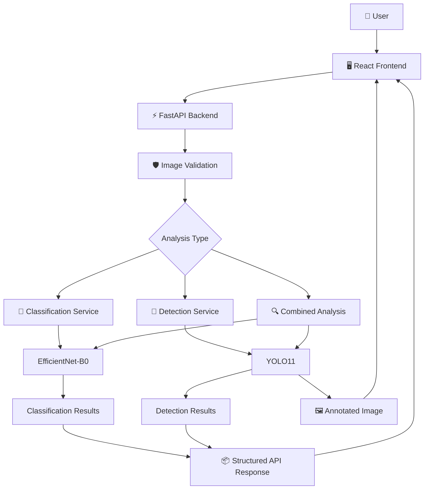
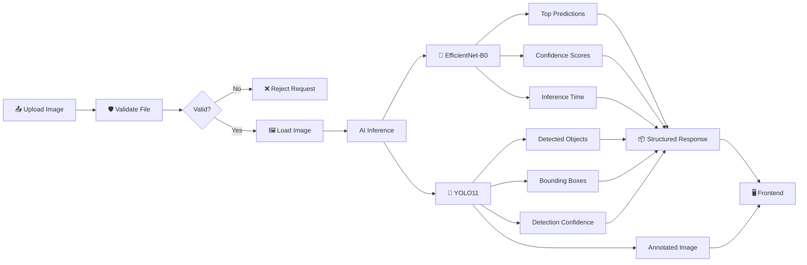
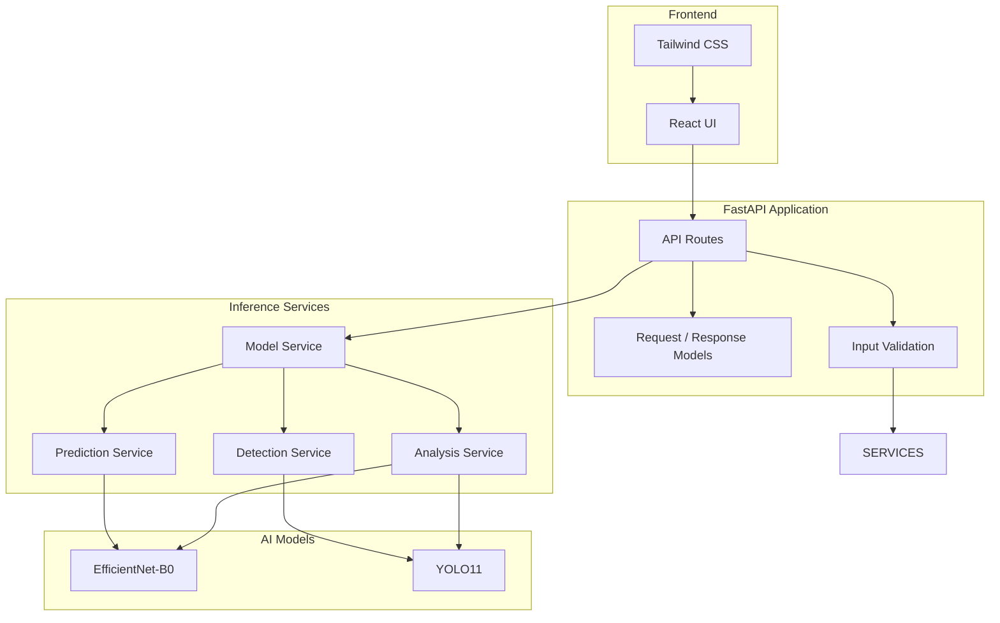
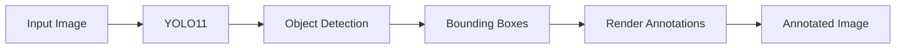
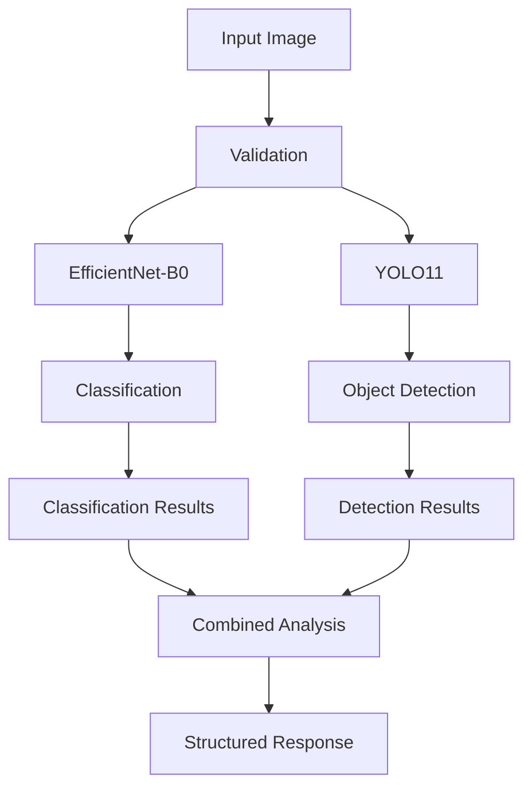
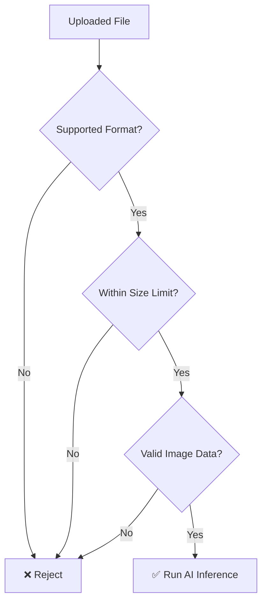
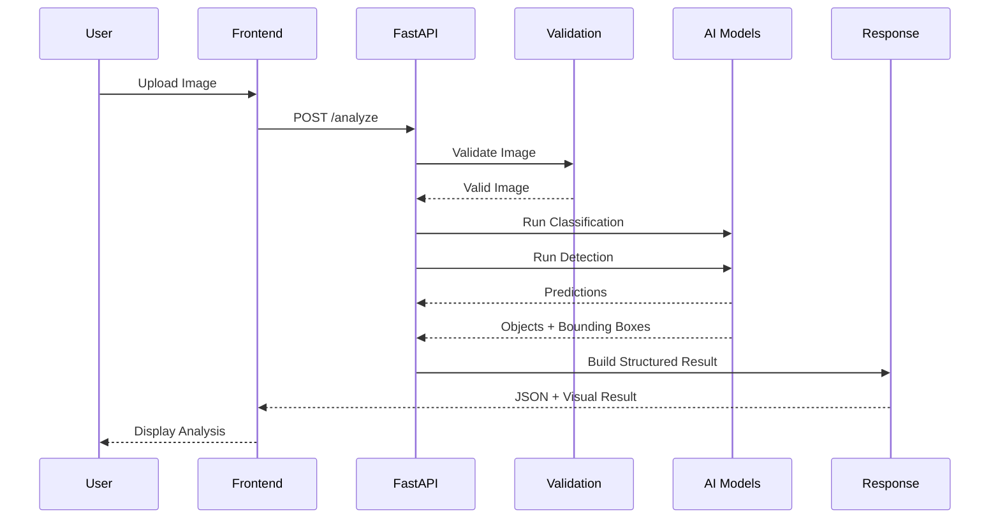
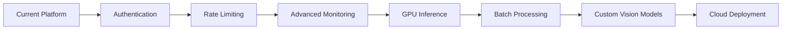

<div align="center">

# 👁️ AI Visual Intelligence API

### **AI-Powered Computer Vision Platform**

**FastAPI · React · Tailwind CSS · PyTorch · YOLO11 · EfficientNet**

Build, analyze, and interact with visual intelligence through a modern full-stack AI platform.

<br>

[](https://www.python.org/)
[](https://fastapi.tiangolo.com/)
[](https://react.dev/)
[](https://pytorch.org/)
[](https://docs.ultralytics.com/)
[](https://www.docker.com/)

<br>

**[GitHub Repository](https://github.com/Debankumardas/AI-Visual-Intelligence-API)**

</div>

---

## 📌 Overview

**AI Visual Intelligence API** is a full-stack computer vision platform designed to turn raw images into structured AI insights.

The project combines a **FastAPI backend**, **React frontend**, and pretrained deep-learning models to provide a unified interface for visual analysis.

Instead of interacting directly with individual computer vision models, applications can communicate with a clean API layer that handles:

* Image validation
* Image classification
* Object detection
* Bounding-box analysis
* Confidence scoring
* Inference timing
* Annotated image generation
* Combined visual analysis
* Interactive API documentation
* Frontend-based visual interaction

The architecture is designed to keep the **frontend, API layer, model logic, and inference services separated**, making the system easier to maintain and extend.

---

# ✨ Key Features

### 🧠 Computer Vision

* Image classification with **EfficientNet-B0**
* Object detection with **YOLO11**
* Top-k classification predictions
* Object labels and confidence scores
* Bounding-box coordinates
* Annotated detection images
* Combined classification + detection

### ⚡ API Engineering

* RESTful FastAPI backend
* Modular service architecture
* Pydantic-based request/response models
* Image validation
* File-size protection
* Supported image-type validation
* Health-check endpoint
* Swagger / OpenAPI documentation

### 🖥️ Frontend

* Modern React interface
* Tailwind CSS styling
* Image upload workflow
* Visual analysis interface
* API-driven architecture
* Separation between UI and inference logic

### 🧪 Engineering

* Automated tests
* Docker support
* Docker Compose configuration
* Environment configuration through `.env`
* CI workflow
* Modular backend architecture

---

# 🏗️ System Architecture


```mermaid
flowchart TB

    U[👤 User] --> FE[🖥️ React Frontend]

    FE --> API[⚡ FastAPI Backend]

    API --> V[🛡️ Image Validation]

    V --> ROUTER{Analysis Type}

    ROUTER --> CLS[🧠 Classification Service]
    ROUTER --> DET[🎯 Detection Service]
    ROUTER --> BOTH[🔍 Combined Analysis]

    CLS --> EN[EfficientNet-B0]
    DET --> YOLO[YOLO11]

    BOTH --> EN
    BOTH --> YOLO

    EN --> CR[Classification Results]
    YOLO --> DR[Detection Results]

    CR --> RES[📦 Structured API Response]
    DR --> RES

    YOLO --> ANN[🖼️ Annotated Image]

    RES --> FE
    ANN --> FE
```

---

# 🔄 Visual Intelligence Pipeline


```mermaid
flowchart LR

    A[📤 Upload Image] --> B[🛡️ Validate File]

    B --> C{Valid?}

    C -->|No| D[❌ Reject Request]
    C -->|Yes| E[🖼️ Load Image]

    E --> F[AI Inference]

    F --> G[🧠 EfficientNet-B0]
    F --> H[🎯 YOLO11]

    G --> I[Top Predictions]
    G --> J[Confidence Scores]
    G --> K[Inference Time]

    H --> L[Detected Objects]
    H --> M[Bounding Boxes]
    H --> N[Detection Confidence]

    H --> O[Annotated Image]

    I --> P[📦 Structured Response]
    J --> P
    K --> P
    L --> P
    M --> P
    N --> P

    P --> Q[🖥️ Frontend]
    O --> Q
```

---

# 🧩 Architecture Layers

The project follows a layered architecture rather than placing all logic inside a single application file.


```mermaid
flowchart TB

    subgraph Frontend
        UI[React UI]
        TW[Tailwind CSS]
    end

    subgraph API["FastAPI Application"]
        ROUTES[API Routes]
        SCHEMAS[Request / Response Models]
        VALIDATION[Input Validation]
    end

    subgraph Services["Inference Services"]
        MODEL[Model Service]
        PRED[Prediction Service]
        DET[Detection Service]
        ANALYSIS[Analysis Service]
    end

    subgraph Models["AI Models"]
        EFF[EfficientNet-B0]
        Y[YOLO11]
    end

    UI --> ROUTES
    TW --> UI

    ROUTES --> SCHEMAS
    ROUTES --> VALIDATION

    VALIDATION --> SERVICES

    ROUTES --> MODEL
    MODEL --> PRED
    MODEL --> DET
    MODEL --> ANALYSIS

    PRED --> EFF
    DET --> Y
    ANALYSIS --> EFF
    ANALYSIS --> Y
```

---

# 🤖 AI Models

## EfficientNet-B0

**EfficientNet-B0** is used for image classification.

The classification pipeline generates ranked predictions for the input image and returns confidence information together with inference timing.

### Output

```text
Input Image
     ↓
Image Preprocessing
     ↓
EfficientNet-B0
     ↓
Top-K Predictions
     ↓
Confidence Scores
     ↓
Inference Time
```

---

## YOLO11

**YOLO11** is used for real-time object detection.

The detection pipeline identifies objects and provides:

* Object class
* Confidence score
* Bounding-box coordinates
* Detection timing
* Annotated image output

### Output

```text
Input Image
     ↓
YOLO11
     ↓
Object Detection
     ↓
Labels + Confidence
     ↓
Bounding Boxes
     ↓
Annotated Image
```

---

# 🔌 API Endpoints

| Method | Endpoint            | Description                         |
| ------ | ------------------- | ----------------------------------- |
| `GET`  | `/`                 | API status                          |
| `GET`  | `/health`           | Health check                        |
| `POST` | `/predict`          | Image classification                |
| `POST` | `/detect`           | Object detection                    |
| `POST` | `/detect/annotated` | Detection with annotated image      |
| `POST` | `/analyze`          | Combined classification + detection |

---

# 🧠 `/predict`

Performs image classification using EfficientNet-B0.

### Request

```http
POST /predict
Content-Type: multipart/form-data
```

Upload an image file.

### Response

```json
{
  "filename": "sample.jpg",
  "predictions": [
    {
      "label": "golden retriever",
      "confidence": 0.9376
    }
  ],
  "inference_time_ms": 42.31
}
```

---

# 🎯 `/detect`

Performs object detection using YOLO11.

### Response

```json
{
  "filename": "sample.jpg",
  "detections": [
    {
      "label": "dog",
      "confidence": 0.9342,
      "box": {
        "x1": 52.41,
        "y1": 31.22,
        "x2": 489.72,
        "y2": 421.63
      }
    }
  ]
}
```

---

# 🖍️ `/detect/annotated`

Runs object detection and returns an image containing the detected objects and bounding boxes.


```mermaid
flowchart LR

    A[Input Image] --> B[YOLO11]
    B --> C[Object Detection]
    C --> D[Bounding Boxes]
    D --> E[Render Annotations]
    E --> F[Annotated Image]
```

---

# 🔍 `/analyze`

The `/analyze` endpoint combines the two primary computer vision capabilities.


```mermaid
flowchart TD

    A[Input Image] --> B[Validation]

    B --> C[EfficientNet-B0]
    B --> D[YOLO11]

    C --> E[Classification]
    D --> F[Object Detection]

    E --> G[Classification Results]
    F --> H[Detection Results]

    G --> I[Combined Analysis]
    H --> I

    I --> J[Structured Response]
```

This endpoint is useful when an application needs both **semantic image classification** and **object-level detection** from the same image.

---

# 🛡️ Image Validation

Before AI inference, uploaded files pass through validation.


```mermaid
flowchart TD

    A[Uploaded File] --> B{Supported Format?}

    B -->|No| X[❌ Reject]
    B -->|Yes| C{Within Size Limit?}

    C -->|No| X
    C -->|Yes| D{Valid Image Data?}

    D -->|No| X
    D -->|Yes| E[✅ Run AI Inference]
```

### Supported formats

* JPEG
* PNG
* WebP

### Maximum file size

```text
10 MB
```

---

# 📦 Project Structure

```text
AI-Visual-Intelligence-API/
│
├── .github/
│   └── workflows/
│
├── app/
│   ├── main.py
│   ├── api/
│   ├── models/
│   └── services/
│
├── frontend/
│   ├── src/
│   ├── public/
│   └── ...
│
├── tests/
│
├── .dockerignore
├── .env.example
├── .gitignore
├── Dockerfile
├── docker-compose.yml
├── requirements.txt
├── run.py
├── sample.jpg
├── yolo11n.pt
└── README.md
```

### Architecture principle

```text
Frontend
   ↓
API Layer
   ↓
Validation
   ↓
Service Layer
   ↓
AI Models
   ↓
Structured Results
```

This separation makes it easier to replace models, add endpoints, introduce authentication, or connect additional client applications.

---

# ⚙️ Tech Stack

| Layer             | Technology                |
| ----------------- | ------------------------- |
| Language          | Python                    |
| Backend           | FastAPI                   |
| Server            | Uvicorn                   |
| Frontend          | React                     |
| Styling           | Tailwind CSS              |
| Deep Learning     | PyTorch                   |
| Classification    | EfficientNet-B0           |
| Object Detection  | YOLO11                    |
| Model Ecosystem   | Torchvision / Ultralytics |
| API Documentation | Swagger / OpenAPI         |
| Testing           | Pytest / Python Tests     |
| Containerization  | Docker                    |
| Orchestration     | Docker Compose            |
| Version Control   | Git / GitHub              |

---

# 🚀 Getting Started

## 1. Clone the repository

```bash
git clone https://github.com/Debankumardas/AI-Visual-Intelligence-API.git

cd AI-Visual-Intelligence-API
```

---

## 2. Create a virtual environment

### Windows PowerShell

```powershell
python -m venv .venv
```

Activate it:

```powershell
.venv\Scripts\Activate.ps1
```

---

## 3. Install backend dependencies

```powershell
pip install -r requirements.txt
```

---

## 4. Configure environment variables

Create a `.env` file using the provided example:

```powershell
Copy-Item .env.example .env
```

Update the values according to your local environment.

> Never commit API keys, credentials, or other secrets to GitHub.

---

# ▶️ Run the Backend

Start the FastAPI application:

```powershell
python run.py
```

The API will be available at:

```text
http://127.0.0.1:8000
```

---

# 📚 API Documentation

FastAPI automatically provides interactive API documentation.

### Swagger UI

```text
http://127.0.0.1:8000/docs
```

### ReDoc

```text
http://127.0.0.1:8000/redoc
```

You can upload images and test the endpoints directly through Swagger.

---

# 🖥️ Frontend

The repository also contains a dedicated React frontend.

```text
frontend/
```

The frontend communicates with the FastAPI backend and provides the user-facing interface for visual analysis.

Install frontend dependencies according to the package configuration inside the `frontend` directory.

```powershell
cd frontend
npm install
```

Start the development server:

```powershell
npm run dev
```

> The exact frontend command may depend on the current frontend configuration.

---

# 🐳 Docker

The project includes Docker configuration for containerized execution.

### Build

```powershell
docker compose build
```

### Start

```powershell
docker compose up
```

### Stop

```powershell
docker compose down
```

Docker allows the backend environment and its dependencies to be reproduced more consistently across machines.

---

# 🧪 Testing

The project contains automated test coverage under:

```text
tests/
```

Run the test suite with:

```powershell
pytest
```

For individual API/model tests, use the relevant test module inside the `tests` directory.

---

# 🔬 Request Lifecycle

A complete visual-analysis request follows this flow:


```mermaid
sequenceDiagram

    participant User
    participant Frontend
    participant API as FastAPI
    participant Validation
    participant Models as AI Models
    participant Response

    User->>Frontend: Upload Image
    Frontend->>API: POST /analyze

    API->>Validation: Validate Image
    Validation-->>API: Valid Image

    API->>Models: Run Classification
    API->>Models: Run Detection

    Models-->>API: Predictions
    Models-->>API: Objects + Bounding Boxes

    API->>Response: Build Structured Result
    Response-->>Frontend: JSON + Visual Result

    Frontend-->>User: Display Analysis
```

---

# 🎯 Use Cases

The platform can serve as a foundation for:

* Computer vision applications
* AI-powered web applications
* Image analysis dashboards
* Object detection systems
* Visual inspection systems
* Image classification services
* AI inference backends
* Educational computer vision platforms
* Rapid computer vision prototyping
* Frontend applications requiring visual AI

---

# 📈 Engineering Highlights

This project demonstrates more than simply running pretrained models.

### Architecture

* Modular FastAPI backend
* Separate service layer
* Dedicated model components
* Structured request/response schemas
* Frontend/backend separation

### Computer Vision

* Classification
* Object detection
* Bounding-box visualization
* Confidence scoring
* Combined visual analysis

### Software Engineering

* Input validation
* Automated testing
* Environment configuration
* Docker support
* CI workflow
* API documentation

### Full-Stack AI

```text
React
  ↓
FastAPI
  ↓
Validation
  ↓
Inference Services
  ↓
PyTorch / YOLO
  ↓
Structured Results
  ↓
React Visualization
```

---

# ⚠️ Current Limitations

The project is primarily intended as a **portfolio, learning, and development platform**.

Current limitations include:

* Classification uses a pretrained ImageNet model rather than a custom domain-specific classifier.
* YOLO11n is optimized for lightweight inference and may trade some accuracy for speed compared with larger models.
* Production deployment would require additional security and infrastructure.
* Authentication and authorization should be added before exposing the API publicly.
* Rate limiting should be implemented for production workloads.
* Monitoring and structured production logging can be expanded.
* GPU acceleration depends on the deployment environment.

---

# 🔮 Future Roadmap


```mermaid
flowchart LR

    A[Current Platform] --> B[Authentication]
    B --> C[Rate Limiting]
    C --> D[Advanced Monitoring]
    D --> E[GPU Inference]
    E --> F[Batch Processing]
    F --> G[Custom Vision Models]
    G --> H[Cloud Deployment]
```

Potential future improvements:

* 🔐 JWT/API-key authentication
* 🚦 API rate limiting
* 📊 Advanced monitoring
* ⚡ GPU inference
* 📦 Batch image processing
* 🧠 Custom-trained vision models
* 🎚️ Configurable confidence thresholds
* 📝 Structured logging
* ☁️ Cloud deployment
* 🔄 Improved CI/CD
* 🗄️ Optional inference history/database
* 📱 Extended frontend capabilities

---

# 🧠 What This Project Demonstrates

This project demonstrates the complete journey from a pretrained computer vision model to a usable AI application:

```text
Pretrained Models
       ↓
Model Abstraction
       ↓
Inference Services
       ↓
FastAPI REST Layer
       ↓
Validation & Structured Responses
       ↓
React Frontend
       ↓
Docker / CI
       ↓
Usable Visual Intelligence Platform
```

The focus is not only on model inference, but on **engineering AI systems that can actually be consumed by applications**.

---

# 👨‍💻 Author

## Deban Kumar Das D

**Data Science · Machine Learning · Artificial Intelligence · Computer Vision**

I build practical AI and data-driven applications with a focus on turning machine-learning capabilities into usable software systems.

### Connect

[](https://github.com/Debankumardas)

[](https://www.linkedin.com/in/debankumardasd/)

---

<div align="center">

### ⭐ If you find this project useful, consider starring the repository.

**Build · Experiment · Evaluate · Improve**

</div>
